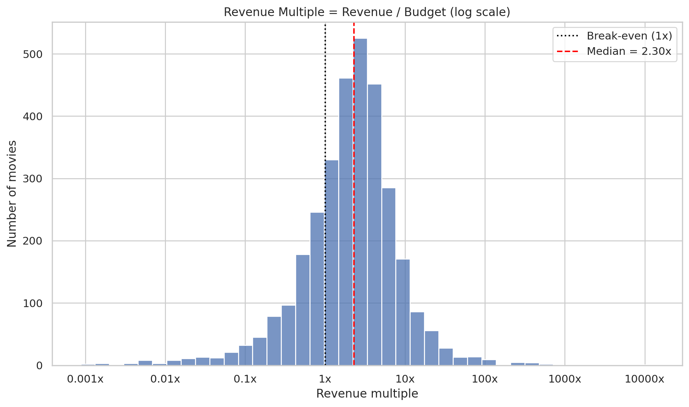
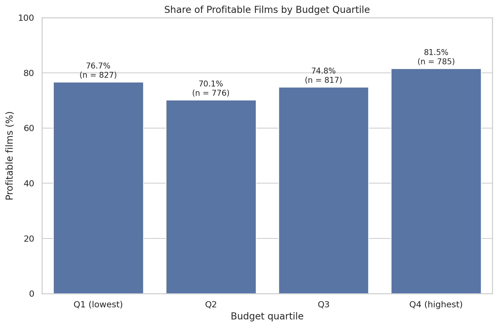
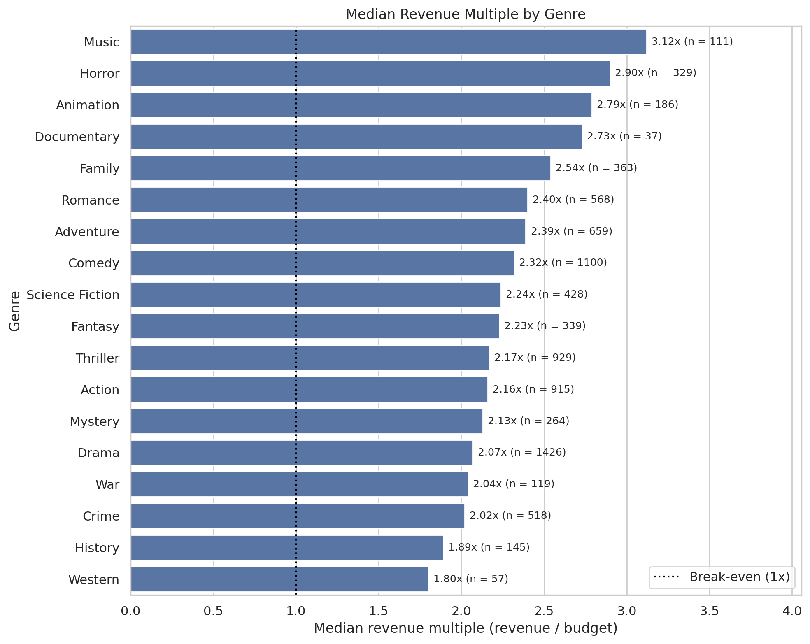
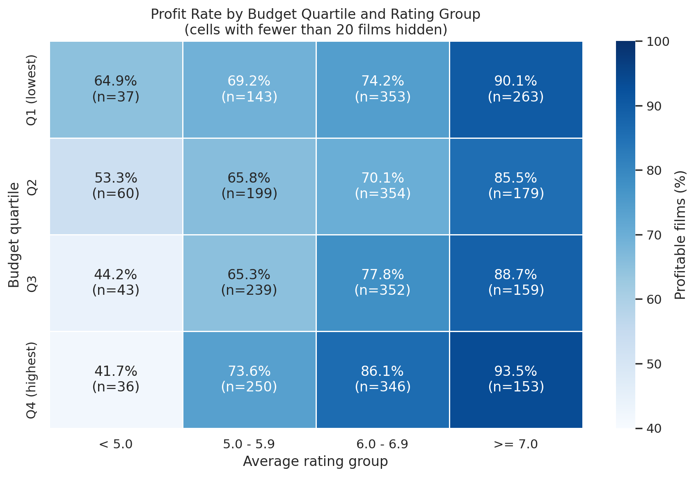
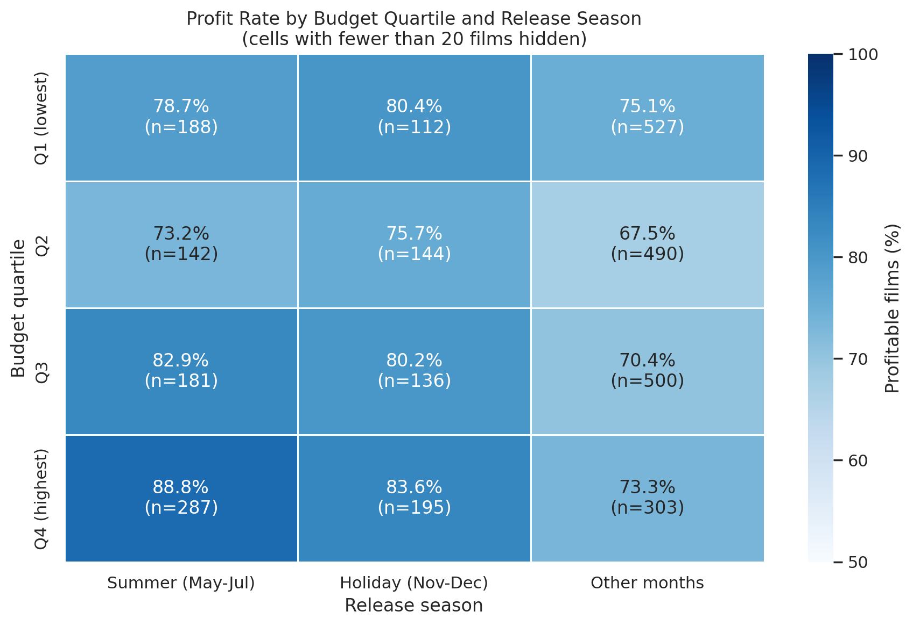

# TMDB Movie Analytics: What Separates Profitable Films from Unprofitable Ones?

[](https://colab.research.google.com/github/fiannnn9090/tmdb-movie-analytics/blob/main/notebooks/tmdb_movie_analytics.ipynb)

## Overview

Exploratory data analysis of the TMDB 5000 Movie Dataset (4,803 films, 1916-2017) to understand
which factors are associated with a film earning back its budget. Instead of looking at revenue
alone, the analysis measures return per dollar with the **revenue multiple** (revenue / budget,
where 1.0x is break-even).

## Business Question  

> What distinguishes films that earn back their budget from those that do not?

1. How many films are profitable?
2. Does a bigger budget guarantee a better return?
3. Which genres give the best return?
4. Is audience rating associated with profitability?
5. Does release timing matter?

## Dataset

- **Source:** [TMDB 5000 Movie Dataset on Kaggle](https://www.kaggle.com/datasets/tmdb/tmdb-movie-metadata)
  (file `tmdb_5000_movies.csv`), derived from [TMDB](https://www.themoviedb.org/). Please check the
  Kaggle page for license and attribution terms.
- **Size:** 4,803 films. The data file is not included in this repository.

## Method

- Treated 0 in budget, revenue and runtime as missing data rather than real values.
- Defined *valid financial data* as budget and revenue of at least $10,000: **3,205 films (66.7%)**.
- Used films with at least 10 votes for rating analysis (4,392 films; 3,166 with valid financials).
- Reported **medians** and used log scales, because budget, popularity and return are right-skewed.
- Used **Spearman** rank correlation, which is robust to extreme values.
- Checked whether patterns survive after splitting films into budget quartiles, and ran a
  robustness check on unusual low-revenue films.

## Key Findings

**Headline (3,205 films with valid financials):** 75.79% were profitable, the median revenue
multiple was 2.30x, and 24.2% earned less than their budget. Median budget was $25.5M, median
revenue $56.3M and median profit $27.1M.

| Question | Finding |
|---|---|
| Budget | Strongly related to absolute revenue (Spearman 0.67) but weakly and negatively to revenue multiple (-0.14). Median profit rises from $8.5M (lowest budget quartile) to $112.3M (highest), while the median multiple falls from 3.57x to 2.22x. |
| Genre | Horror: low budget ($14M median), highest profit rate (82.1%). Animation: highest median budget ($75M) and median profit ($126.8M). Drama, History and Western are at the lower end (about 70-71% profitable). |
| Rating | Profit rate rises from 51.1% (rated below 5.0) to 89.4% (rated 7.0+). The pattern holds inside every budget quartile, and the gap widens with budget (25 points in the lowest quartile, 52 in the highest). |
| Timing | Summer (May-Jul) and holiday (Nov-Dec) releases: 82.3% and 80.2% profitable, versus 71.5% for other months. The advantage holds in every budget quartile. September is the weakest month (65.5% profitable). |







## Business Implications

These are descriptive associations, not causal claims.

1. **Choose the objective before the budget.** Large budgets raise absolute profit and lower loss
   risk, but not return per dollar.
2. **Genre offers two routes to profit:** low-budget Horror and high-budget Animation.
3. **Timing matters most for big-budget films:** summer and holiday releases show the largest advantage.
4. **Quality risk is highest for expensive films.** In the two highest budget quartiles, the median
   film rated below 5.0 did not recover its budget (interpretation, not a tested result).

## Limitations

- Only 66.7% of films have usable financial data, so results may not generalize to all films.
- Budget and revenue are in nominal dollars (no inflation adjustment) across 1916-2017.
- The dataset does not state whether revenue includes home video or streaming, or whether release
  dates are US or worldwide.
- Ratings are given after release, and budget was controlled with only four quartile groups.
- Genres overlap and some genres are small samples (Documentary n = 37, Western n = 57).
- Season groups were defined after inspecting the data, and no formal statistical tests were run.

## Repository Structure

```text
tmdb-movie-analytics/
├── notebooks/
│   └── tmdb_movie_analytics.ipynb
├── images/              # 14 charts exported by the notebook
├── requirements.txt
└── README.md
```

## How to Run

1. Click the **Open in Colab** badge above.
2. Download `tmdb_5000_movies.csv` from the Kaggle link in the Dataset section.
3. Run all cells (`Runtime > Run all`) and upload the CSV when prompted.

To run locally, install the dependencies with `pip install -r requirements.txt` and place the CSV
next to the notebook.

## Tools

Python, Pandas, NumPy, Matplotlib, Seaborn, Google Colab

## Author

Aliffian Alham Maesanjaya ([GitHub](https://github.com/fiannnn9090) | [LinkedIn](https://linkedin.com/in/aliffianmsj))
